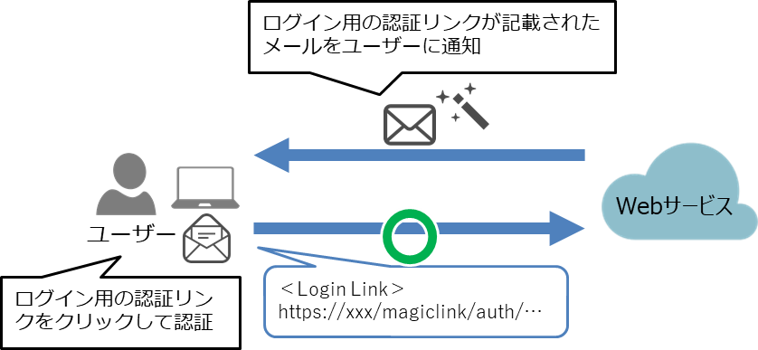
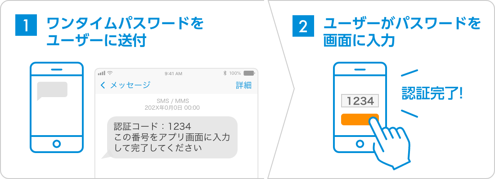
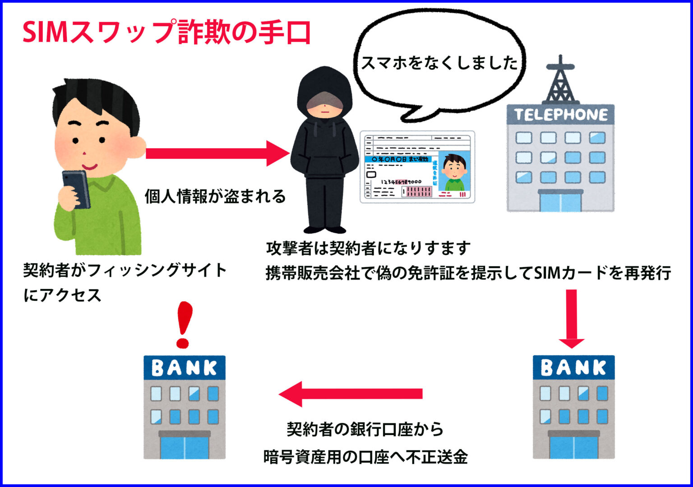

---
# You can also start simply with 'default'
theme: default
# random image from a curated Unsplash collection by Anthony
# like them? see https://unsplash.com/collections/94734566/slidev
background: http://image.gihyo.co.jp/assets/images/cover/2025/9784297146535.jpg
# some information about your slides (markdown enabled)
title: パスキーのすべて「1.3 パスワードレス認証」について

# apply unocss classes to the current slide
class: text-center
# https://sli.dev/features/drawing
drawings:
  persist: false
# slide transition: https://sli.dev/guide/animations.html#slide-transitions
transition: slide-left
# enable MDC Syntax: https://sli.dev/features/mdc
mdc: true
# open graph
# seoMeta:
#  ogImage: https://cover.sli.dev
---

# 1.3 「パスワードレス」

---
transition: fade-out
---

# パスワードレス認証とは

<h2 v-click>パスワードを使用すると認証強度が下がる</h2>

<br />

<h2 v-click>二要素認証もユーザーの手間が増える</h2>

<br />

<h2 v-click>なら、そもそもパスワードを使わせない認証方法にしよう</h2>

<div v-click style="position:absolute;top:0;left:0; height:100vh;width:100%;">
<SlideTitle >
このアプローチによる認証が<br/>パスワードレス認証
</SlideTitle>
</div>

---
transition: fade-out
---

<SlideTitle>
マジックリンク
</SlideTitle>

---
transition: fade-out
---

# マジックリンクとは
<div style="display:flex;justify-content:center;height:90%;flex-direction:column;">

<p>
<a href="https://www.ogis-ri.co.jp/column/themistruct/c106538.html" style="font-size: 0.8em;">パスワードレス認証とは？認証の種類と仕組み、メリットと注意点について解説</a> より引用
</p>
</div>

---
transition: fade-out
---

<SlideTitle>
マジックリンクの課題
</SlideTitle>

---
transition: fade-out
---

# ログイン手順の煩雑さ

<br />

### ・ログインするためにWebサイトとメールを行ききする必要がある  

<br />

### ・メールアプリのWebViewerが開くと意図したブラウザでセッションが確立できない  

<br />

### ・セッションが短いアプリだとユーザーが認証に疲れてしまう  

<br />

### ・認証の強度がメールサービスに依存  

---
transition: fade-out
---

<SlideTitle>
課題の一部を体験しよう
</SlideTitle>

---
transition: fade-out
---
# 以下のマジックリンクを使用することによるリスクをデモします

## セッションが異なるブラウザで作成される
<br />

## トークンが適切に削除できていないことによるリンクの使い回し

<br />

デモ用のアプリのコードは[こちら](https://github.com/maronnjapan/passkey-book-reading-1-3/tree/main/magic-link-app)においてあります

---
transition: fade-out
---
# マジックリンクは昨今自前で実装しないのでは？

## (実は前職でマジックリンクを自前で実装したことがあります)

<SlideTitle v-click>
認証情報を持つのはそれだけでリスクになる
</SlideTitle>

---
transition: fade-out
---

<SlideTitle>
SMS認証
</SlideTitle>

---
transition: fade-out
---

# SMS認証について
## SMS(Short Message Service)を使用した認証方式
<div style="display:flex;justify-content:center;height:90%;flex-direction:column;">

<p>
<a href="https://media-sms.net/column/certification/" style="font-size: 0.8em;">SMS認証を導入するには？SMS認証の特徴や導入方法について詳しく解説！</a> より引用
</p>
</div>

---
transition: fade-out
---

<SlideTitle>
SMS認証のユーザビリティ上の課題
</SlideTitle>

---
transition: fade-out
---

# ①SMSにURLを添付するとスパムになる場合がある
## →マジックリンクのようにURLクリックによる認証はできない可能性あり
## →フォームに自分で入力してもらう必要がある
<br />

# ②登録済みSIM搭載の携帯以外でSMSを受け取れない
## →パソコンで認証したいときなどは、マジックリンク以上に手間がかかる

---
transition: fade-out
---

## OTP入力の手間の対応策①：autocomplete="one-time-code"を設定
<div style="display:flex;justify-content:center;height:90%;flex-direction:column;">
<div style="display:flex;justify-content:center;height:80%;">
<video controls width="250" style="height:100%;">
  <source src="./images/ios-safari.webm" type="video/webm" />
</video>
</div>
<p style="text-align:center;">
<a href="https://web.dev/articles/sms-otp-form?hl=ja" style="font-size: 0.8em;">SMS OTP フォームのベスト プラクティス</a> より引用
</p>
</div>

---
transition: fade-out
---

# フィッシングの緩和策

## 以下の値をSMSに付与すると、ドメインに紐づく場合のみ補完が出る
```
@ドメイン名 #OTPの値
```

---
transition: fade-out
---

## OTP入力の手間の対応策②：WebOTP APIの使用
<div style="display:flex;justify-content:center;height:90%;flex-direction:column;">
<div style="display:flex;justify-content:center;height:80%;">
<video controls width="250" style="height:100%;">
  <source src="./images/android-chrome.webm" type="video/webm" />
</video>
</div>
<p style="text-align:center;">
<a href="https://web.dev/articles/sms-otp-form?hl=ja" style="font-size: 0.8em;">SMS OTP フォームのベスト プラクティス</a> より引用
</p>
</div>

---
transition: fade-out
---

## [navigator.credentials.get()](https://developer.mozilla.org/docs/Web/API/CredentialsContainer/get)でサイトに紐つくSMS内のOTPを取得可能
<br />
```js
if ('OTPCredential' in window) {
  window.addEventListener('DOMContentLoaded', e => {
    // autocomplete="one-time-code"を設定したフォーム要素取得
    const input = document.querySelector('input[autocomplete="one-time-code"]');
    if (!input) return;
    const form = input.closest('form');

    // サイトに紐づいたSMSのOTPを取得する
    navigator.credentials.get({
      otp: { transport:['sms'] },
      signal: ac.signal
    }).then(otp => {
      // 取得出来た場合、フォームにOTPを入力し、送信する
      input.value = otp.code;
      if (form) form.submit();
    })
  });
}
```

<p style="text-align:center;">
<a href="https://web.dev/articles/sms-otp-form?hl=ja" style="font-size: 0.8em;">SMS OTP フォームのベスト プラクティス</a> より引用(コード一部改変)
</p>

---
transition: fade-out
---

<SlideTitle>
SMS認証のセキュリティ上の課題
</SlideTitle>

---
transition: fade-out
---

# セキュリティの課題①：SIMスワップ

<div style="display:flex;justify-content:center;flex-direction:column;">

<p style="text-align:center;">
<a href="https://frauddetection.cacco.co.jp/media/news/10269/" style="font-size: 0.8em;">SIMスワップ詐欺とは？スマホが乗っ取られて不正送金される被害が増加中</a> より引用
</p>
</div>

---
transition: fade-out
---

# セキュリティの課題②：電話番号再利用による認証突破

## 携帯電話番号は解約後、一定期間がたてば再利用される
## [総務省による諮問会](https://www.soumu.go.jp/main_content/000182670.pdf)でも再利用していることを言及あり

<br />

## →SMSで認証していたサイトを別の人でも認証できてしまう

<br />

## →攻撃者に狙われるリスクを抱えることになる

---
transition: fade-out
---
# まとめ
<br />

## パスワードレス認証はパスワードを使用しない認証
<br />

## 書籍ではマジックリンクとSMS認証を取り上げていた

<br />

## 各種認証はパスワードを使用しないが、ユーザビリティ・セキュリティ面での課題がある

